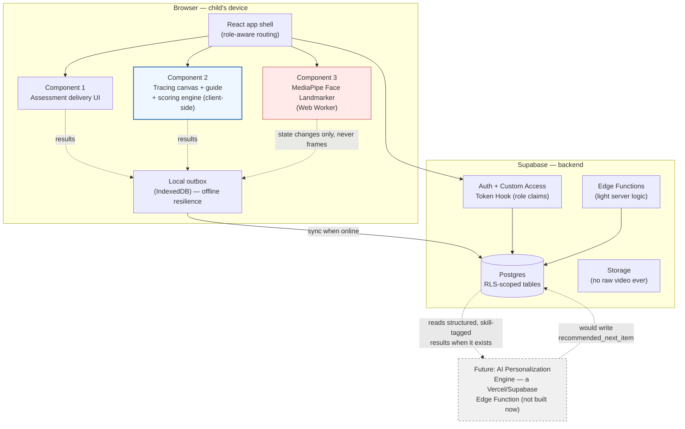
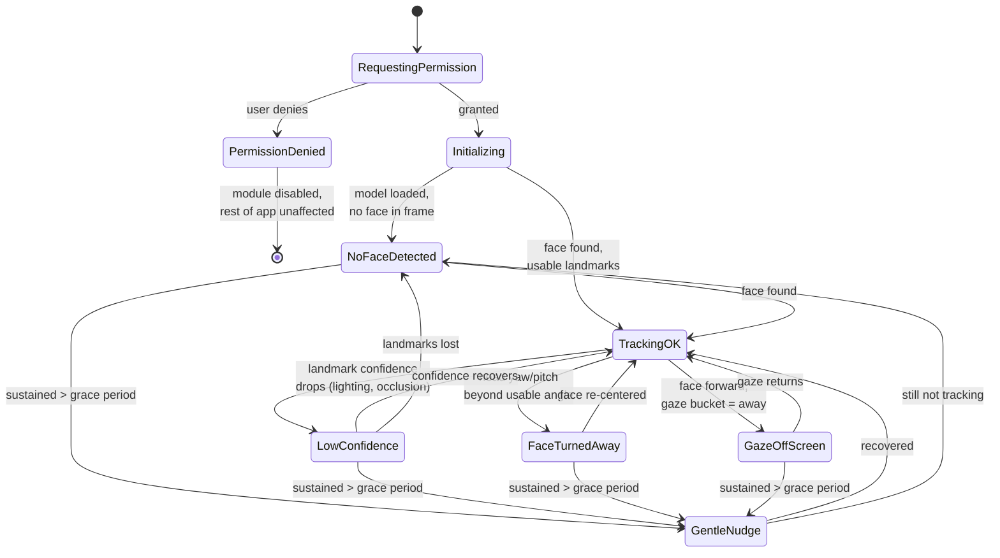

# Website Plan — Technical Architecture & Stack

> **Scope: website only.** No native app (see `APP.md` for that, later), no EEG, no Indic-script content, no AI personalization engine yet. This document covers the 3-component MVP described in `README.md`.

---

## 0. Recommended stack at a glance

| Layer | Recommendation | One-line why |
|---|---|---|
| Frontend framework | **Vite + React 18 + TypeScript**, client-side SPA | Static `dist/` output → portable to a native wrapper later (see `APP.md`); largest ecosystem for canvas/SVG + MediaPipe integration |
| Styling/theming | **Tailwind CSS v4 (`@theme`, CSS variables) + shadcn/ui** | Re-theme by editing CSS variables, not component code — matches "we'll reskin repeatedly" |
| Client state | **Zustand** (UI/session state) + **TanStack Query** (server state via Supabase) | Canvas pointer events must bypass React re-renders entirely; Query handles cache/sync to Supabase cleanly |
| Tracing surface | **SVG guide (stroke-dasharray) + `perfect-freehand` ink layer**, raw pointer path captured separately for scoring | Reuses a proven self-drawing SVG technique; keeps a real coordinate path around for shape comparison |
| Scoring algorithm | **Arc-length resampling → discrete Fréchet distance + stroke-count/direction check**, hand-rolled (~100 lines) | Replaces placeholder circle-radius scoring with genuine shape comparison; cheap enough to run client-side in real time |
| Gaze/attention | **Browser-only: MediaPipe Face Landmarker (`@mediapipe/tasks-vision`) in a Web Worker**, scoped to face-presence + head pose + coarse gaze bucket — **no emotion inference, no server-side model** | Raw video never leaves the device; a server-side tier is a real future upgrade, not an MVP need |
| Sound | **Pre-generated static audio clips (36 files: A–Z, 0–9) + Howler.js**, Web Speech API only as a dev-time fallback | Browser TTS voice quality/availability is inconsistent across devices; 36 clips is cheap to produce once |
| Haptics | **`navigator.vibrate()`** on web (Android Chrome only — iOS Safari blocks it, no workaround) | Real platform limitation; sound + strong visual feedback is the cross-platform fallback channel. Full native haptics arrive with the app — see `APP.md`. |
| Backend/BaaS | **Supabase** (Postgres + Auth + Storage + Edge Functions + RLS) | Relational data fits assessment/session/attention logs far better than a NoSQL store; RLS + JWT claims gives RBAC without a bespoke auth system |
| Auth/RBAC | Supabase Auth + **Custom Access Token Hook** injecting `role`/`child_ids`/`teacher_id` into `app_metadata` → RLS policies read the JWT claim | Current Supabase best practice; avoids a DB round-trip per request |
| Hosting | **Vercel** (frontend) + **Supabase Cloud, Mumbai/Singapore region** (backend) | See §1.7 — chosen specifically with the future AI-agent/streaming path in mind |

---

## 1. Decision-by-decision: recommendation, justification, alternatives

### 1.1 Frontend framework

**Recommended: Vite + React + TypeScript, pure client-side SPA.**

Justification tied to the actual constraints: (a) a static, portable build keeps every future option open — wrapping in a native shell, deploying anywhere, no server dependency at request time; (b) this is a logged-in practice app, not a public content site, so Next.js's SSR/SEO machinery buys nothing; (c) React has the deepest coverage for the two hardest integration points here (MediaPipe Tasks Vision + freehand-canvas libraries), which materially reduces debugging time for a small team.

| Alternative | When you'd pick it instead |
|---|---|
| **Next.js (static export)** | If genuinely public, SEO-relevant pages (a marketing/landing site, published research results) get added alongside the app — otherwise it's added complexity with no payoff here. |
| **SvelteKit (static adapter)** | If bundle size / runtime overhead becomes a real problem on low-end Android tablets (Svelte compiles away, no virtual-DOM tax). Legitimate technically, but smaller ecosystem and less AI-assist coverage for the MediaPipe/canvas integration work — real friction on a deadline. |
| **React Native + React Native Web** | If a single codebase for web+native is wanted from day one and RNW's rough edges on canvas/SVG-heavy interaction are acceptable. Since the plan is "website now, app later is fine," this front-loads risk that isn't needed yet. |
| **Flutter** | If native performance and native camera/haptics access matter more than reusing web tooling. Real tradeoff: MediaPipe Tasks Vision's polished JS/WASM runtime has no Flutter equivalent. |

### 1.2 Styling / theming

**Recommended: Tailwind CSS v4 + shadcn/ui.**

Tailwind v4's `@theme` directive compiles design tokens to live `:root` CSS custom properties, so a full re-skin becomes "edit one CSS file," not "touch every component." shadcn/ui components read semantic variables (`--primary`, `--background`) rather than hardcoding classes internally, and because it's copy-in code (not an npm dependency), every component is owned and modifiable — important for a children's-app UI with atypical needs (large touch targets, high-contrast mode).

**Cheap extension worth adopting now:** two evidence-backed rendering transforms are worth exposing as manual settings via the same theming mechanism from day one — **inter-letter spacing** (`--tracking`, has real RCT support for dyslexic readers) and **line length** (`--line-length`). Nearly free given the theming architecture already in place.

| Alternative | When you'd pick it instead |
|---|---|
| CSS Modules / vanilla-extract + hand-rolled tokens | If maximum control matters more than speed — more setup work, no community components to lean on. |
| Material UI / Chakra UI | If a large pre-built component catalog matters more than reskin flexibility — theming is JS-config-driven, which is *less* flexible for rapid reskinning than CSS-variable-driven Tailwind+shadcn. |

### 1.3 Client state management

**Recommended: Zustand for ephemeral UI/session state + TanStack Query for server state (via `supabase-js`).**

One implementation detail worth flagging explicitly: **pointer-move events during tracing must never go through React state at their native firing rate.** Write incoming points directly to a ref/plain array and only touch React/Zustand state on stroke-end (`pointerup`) or at a throttled interval for the live-ink visual. Routing every `pointermove` through a React re-render is a common cause of jank on low-end Android tablets.

| Alternative | When you'd pick it instead |
|---|---|
| Redux Toolkit | If the team grows and strict action-based debugging/time-travel is needed — overkill at this scope. |
| Context API only | Fine for small, low-frequency state (auth, theme); do not use for stroke capture, for the reason above. |
| Jotai | If fine-grained atomic updates per letter/component are needed later — not necessary to introduce now. |

### 1.4 Tracing/canvas library and rendering surface

**Recommended: SVG throughout — `stroke-dasharray`/`stroke-dashoffset` for the guide animation, `perfect-freehand` for the child's ink layer, with the raw Pointer-Event coordinate array captured independently for scoring.**

**A correction worth flagging early:** `perfect-freehand`'s `getStroke()` does **not** hand back a centerline/skeleton path suitable for shape comparison — it returns the **outline polygon points of the stylized, variable-width ink shape**, meant for rendering, which then becomes an SVG `<path d="...">`. For scoring, what's needed is the *raw* pointer path (the input fed into `getStroke`, i.e. `{x, y, t, pressure}` per point), not its stylized output. So two parallel data flows must run off the same pointer events: one feeds `perfect-freehand` → SVG path → visual ink; the other feeds a resampler → similarity scoring.

Use **Pointer Events** (not separate mouse/touch handlers) — one API surface for mouse, touch, and stylus, with `preventDefault()` on `touchstart`/`pointerdown` to stop scroll/zoom gestures.

Capture strokes as an **ordered array of stroke segments** (new segment on every `pointerdown`), not one flat point blob — some letters genuinely need a pen lift (A, F, T, X), and stroke-order pedagogy cares about that.

| Alternative | When you'd pick it instead |
|---|---|
| Raw Canvas 2D | Zero dependencies, but path data has to be reconstructed manually anyway — the same point array ends up being captured regardless, so perfect-freehand costs little and buys pressure-sensitivity + cleaner rendering for free. |
| `atrament` | Smaller/less maintained than perfect-freehand; no compelling reason to prefer it here. |
| Canvas-only live layer + SVG-on-commit hybrid | If profiling on target devices shows SVG re-render jank — the documented performance escape hatch, not the default. |

### 1.5 Gaze/attention-monitoring tier

**Recommended for the MVP: browser-only, MediaPipe Face Landmarker (`@mediapipe/tasks-vision`), running in a Web Worker, scoped strictly to face-presence + head pose + coarse gaze bucket. No server-side model, no gaze-to-pixel calibration, no emotion inference.**

Three points settle this rather than just inform it:

1. **Calibrated gaze-point regression (WebGazer-style) isn't needed for this task at all.** The requirement is "is the child paying attention," not "which word on screen are they looking at." What's actually needed — face presence, head pose, eye openness, a coarse forward/away gaze bucket — MediaPipe's `FaceLandmarker` gives directly via `facialTransformationMatrixes` and blend shapes, **with no per-child calibration step**.
2. **The known limitation that face-landmark detection struggles beyond ~45° head rotation is a feature here, not a bug** — no usable landmarks *is itself* the "child turned away" signal.
3. **Hard rule: on-screen/off-screen and head pose only, never emotion inference.** Good engineering practice regardless of jurisdiction, and it avoids drifting this module toward looking like a dyslexia-*detection* tool — it's an engagement proxy for a child already using the app, not detection of anything about the child's condition.

Run inference **throttled to ~2–5 fps** in a **Web Worker** — attention state doesn't need 30fps granularity, and the tracing canvas's pointer-response latency must not compete with WASM ML inference on the main thread.

**Server-side tier (a dedicated gaze-estimation model via a separate microservice): explicitly deferred.** It adds real infrastructure for a signal that currently has no downstream consumer that would benefit from angular precision, and it changes the privacy posture materially (§5). Document it as a named future upgrade path.

| Alternative | When you'd pick it instead |
|---|---|
| **WebGazer.js** | If calibrated gaze-to-screen-pixel estimates are specifically needed and an effectively unmaintained dependency built on an older face model is acceptable. |
| **Server-side gaze model** | Once genuine gaze-angle precision is needed for research purposes. Treat this as a separate, explicitly-labelled tier, not a default. |

### 1.6 Backend / BaaS

**Recommended: Supabase.**

Postgres fits the relational shape of assessment results, session data, and attention logs far better than a document store; RLS + a Custom Access Token Auth Hook (injecting `role` and scoping IDs into `app_metadata`) is current best practice and avoids a DB lookup per request; and it gives a real admin UI (Table Editor) for free — the teammate handling assessment content can manage the letter/number corpus directly in Supabase Studio without any admin panel being built.

For light server-side logic, use **Supabase Edge Functions (Deno)** rather than standing up a separate Node service.

| Alternative | When you'd pick it instead |
|---|---|
| **Firebase** | If real-time mobile SDKs matter more than relational data modeling — but Firestore is a worse fit for the psychometric/progress data shape, and Firebase Auth doesn't map as cleanly to fine-grained RBAC. |
| **PocketBase** | For the absolute lowest-ops option on a very small pilot. Real cost: SQLite's ceiling if scaling to multiple schools, weaker RLS-equivalent expressiveness. |
| **Custom Node/Express + Postgres** | If control beyond what Supabase gives is needed — but this reinvents infrastructure Supabase already provides. |

### 1.7 Hosting — and the future AI-agent question

**Recommended: Vercel** (frontend) **+ Supabase Cloud**, Mumbai or Singapore region (backend).

This was worth reconsidering directly against a specific question: *will the site need dynamic components later, when AI-agent-based personalization gets added?* The answer shapes the hosting choice.

**What "dynamic" will and won't mean here.** Adding an AI personalization engine later will need a **dynamic API** — a serverless function that reads a child's session/skill data and returns a routing decision, possibly streaming an LLM's response token-by-token. It will **not** need server-rendered HTML. This stays a logged-in practice app, not a public content site, so nothing about adding AI features changes the SSR calculus in §1.1 — Next.js still buys nothing here.

**Why Vercel specifically, given that:**
- **Vercel + Supabase is the dominant, best-documented pattern (2025–2026) for exactly this shape of app** — a static/Jamstack frontend with serverless backend logic that later adds LLM-based features. Vercel ships the **AI SDK**, a TypeScript library purpose-built for streaming model responses, with React hooks that work in any React app (not Next.js-exclusive).
- **Vercel Edge Functions have near-zero cold starts**, which matters for a responsive personalization endpoint a child is actively waiting on (vs. Node-runtime functions, which can take 500ms–2s on first invocation after inactivity — worth deliberately choosing the edge runtime for latency-sensitive endpoints when that day comes).
- **Preview deployments per branch/PR** match the explicit "we'll be reskinning repeatedly across iterations" workflow well — every UI change gets a shareable URL before it merges.
- **One caveat to know now, not discover later:** the free Hobby tier is restricted to **non-commercial use** by Vercel's own terms. Almost certainly fine for a student research project; relevant only if the project is ever monetized, at which point Pro ($20/seat/month) applies.

**Concretely, when the AI agent arrives:** it plugs in as a Vercel Edge Function (or a Supabase Edge Function — either works; Vercel's is the more natural home if streaming via the AI SDK is wanted) sitting behind the `getNextItem(childId)` boundary already described in §2. The frontend calls it via `fetch()`/TanStack Query exactly like every other Supabase call today — no frontend rearchitecture. If a teacher/parent dashboard needs to reflect an agent's decision live, that's **Supabase Realtime** (a Postgres change feed over websockets), also requiring no SSR. If the personalization engine eventually needs heavier ML inference (not just calling an LLM API), that's the point to introduce a dedicated microservice — same tiering logic as the gaze-tracking discussion in §1.5, not a decision to make now.

| Alternative | When you'd pick it instead |
|---|---|
| **Cloudflare Pages** | Still a fully valid choice — comparable free tier, comparable preview-deployment workflow, a strong global edge network, and no non-commercial restriction on its free tier. Worth revisiting if Vercel's Hobby-tier commercial restriction becomes a real constraint, or if the project standardizes on Cloudflare Workers for other reasons. |
| **Netlify** | Similar Jamstack-hosting category to both of the above; no specific advantage over Vercel for this project's stated future direction (AI SDK / streaming). |

### 1.8 Later: native app

Moved to `APP.md` — not part of the current website scope.

---

## 2. System architecture — how the three components connect

### What's client-only vs. what needs a backend call

| Component | Client-side (no round trip needed) | Backend interaction |
|---|---|---|
| **1. Assessment** | Rendering questions, capturing responses, immediate feedback for objective item types | Item bank fetched from Postgres (not hardcoded in the bundle, so content can be edited without a redeploy); **raw responses always persisted**, not just a computed score |
| **2. Tracing engine** | Guide animation, live ink rendering, real-time scoring (Fréchet/DTW is cheap enough to run entirely in-browser), haptic/sound feedback — must work fully offline | Reference letter/number stroke corpus ships bundled in the static build; session results batched to Postgres asynchronously, queued locally if offline |
| **3. Gaze/attention** | Camera capture, inference, state-machine logic — raw video never leaves the device | Only derived state (`engaged`/`drifting`/`disengaged`/`untrackable` + confidence + timestamp) is periodically batched to Postgres |

The offline-outbox pattern is deliberate, not incidental: connectivity in Indian school/home settings is not a given.

### Data model — what gets stored, at a glance

| Table (conceptual) | Key fields | Written by | Read by |
|---|---|---|---|
| `child_profiles` | id, parent_id, display_name, dob/age_band, active_settings | Parent/Teacher | Child (own), Parent (own children), Teacher (roster), Admin |
| `consent_records` | child_id, data_class (`assessment`/`tracing`/`camera_gaze`), granted_by, granted_at, revoked_at | Parent | Same as above; enforced at RLS + feature level (camera module simply doesn't start if `camera_gaze` isn't granted) |
| `assessment_responses` | child_id, item_id, raw_response, submitted_at | Child session | Parent/Teacher (own/roster), Admin |
| `tracing_sessions` | child_id, grapheme_id (`A`, `7`, …), score, sub_scores, stroke_data (compressed), started_at, completed_at | Tracing engine, client-batched | Parent/Teacher/Admin |
| `attention_logs` | session_id (fk), state, confidence, source (`gaze` now; reserved for future sensing tiers), started_at, duration | Gaze module, client-batched | Parent/Teacher (own/roster); Admin/research (aggregate) |
| `content_items` | id, skill_tag, difficulty, script (`latin` now), provenance | Content owner via Supabase Studio | Client app (public read, RLS-gated) |

Two design choices here are deliberately future-proofing: **always persist raw responses/strokes, not just derived scores** (lets scoring logic evolve retroactively), and **tag every content item and result with a `skill_tag`** even when today it's trivially just "the letter itself." Both cost nothing now and are exactly what a future personalization engine needs (§1.7).

### RBAC roles

| Role | Can see | Can do | Cannot |
|---|---|---|---|
| **Child** (profile, not independent login) | Own progress, streaks, kid-friendly feedback | Take assessment, do tracing sessions | See other children's data, see raw scores/internals, change settings |
| **Parent/Guardian** | Own child(ren)'s full progress + reports | Create child profiles, grant/revoke consent **per data class independently**, view reports | See other families' data |
| **Teacher/Special Educator** | Roster of assigned children | Flag non-responders, add notes, view roster progress | See other teachers' rosters, change RBAC |
| **Admin/Researcher (internal)** | De-identified/pseudonymized aggregate data by default | Manage content bank, manage role assignments, view audit logs | — |

**Note on children ages 6–12:** they shouldn't independently manage credentials. A "profile" model is recommended instead of a true child login — the parent or teacher authenticates, and the child picks an avatar/PIN-free profile on a handed-off device. This satisfies India's DPDP Act s.9 verifiable-parental-consent requirement, because consent is captured at the parent's authenticated session, not asserted by a self-declared child account.

---

## 3. Tracing-accuracy scoring algorithm — concrete spec

This replaces a placeholder (fixed-radius-circle + point count, where a scribble in the middle of the canvas would score near 100%) with genuine shape comparison.

1. **Capture.** Each `pointerdown` starts a new stroke segment; record `{x, y, t, pressure?}` per point via `pointermove` at native rate (written to a ref, not React state). A traced grapheme is an ordered array of stroke segments.
2. **Reference authoring.** Each grapheme (`A`, `7`, …) is defined as an ordered list of reference strokes, each an SVG path — `{grapheme_id, script, strokes: [{order, path_d, start_point, initial_direction_vector}]}`.
3. **Resampling.** Resample *both* the captured stroke points and the reference path to N points (N≈64–100) via **arc-length parameterization** — normalizes away drawing-speed variance and differing point counts.
4. **Do not scale/position-normalize.** For *tracing* (drawing directly over a fixed-position guide), a child who draws in the wrong place or size relative to the guide should be penalized — unlike generic shape-recognition, which typically wants scale/translation invariance. Only correct for a genuine coordinate-space mismatch between the guide's SVG viewBox and the canvas's pixel space.
5. **Shape similarity.** Concatenate the child's resampled stroke points in temporal order and compare against the reference using **discrete Fréchet distance** (Eiter–Mannila formulation, O(N²), trivial client-side at N≈100). Fréchet is recommended over DTW as the primary metric because it measures the maximum deviation ("leash length") between curves, which maps more intuitively onto "did you stay on the line" than DTW's summed local cost.
6. **Stroke-count / order / direction check — a separate, secondary signal.** For each reference stroke, check whether a captured stroke started within a tolerance radius of the reference's start point and whether its initial direction is within an angular tolerance — a coarse categorical check that modulates the score rather than dominating it.
7. **Visual feedback overlay.** As a byproduct of the same comparison, compute per-point nearest-reference-point distance and color-code the child's stroke (green where accurate, red where it drifted).
8. **Normalization and bands.** Normalize the raw Fréchet distance against the glyph's bounding-box diagonal to get a 0–100 score, combined with the stroke-order modifier (suggested starting weights: ~70% shape, ~15% stroke count, ~15% direction — **flagged explicitly as needing empirical tuning against real child traces before shipping**). Present qualitative bands ("Great tracing!" / "Good, keep practicing" / "Let's try again together") rather than a raw number as the primary UX.
9. **Build vs. buy.** Short enough (~100 lines) to hand-roll and own outright — preferable given this is the core deliverable. Small existing npm packages (e.g. `curve-matcher`) exist if preferred; verify maintenance before depending on one.
10. **A legitimate cheaper v0.** A waypoint-crossing-in-order check (N ordered waypoints with tolerance radii, score = fraction crossed in order) is worth building as a day-one stepping stone — but don't stop there.

---

## 4. Gaze-tracking failure-mode state machine

Design rules — per-signal hysteresis, sustained-duration gating, rate-limited intervention:

- **Every non-`TrackingOK` state requires N consecutive low-confidence frames or a rolling-window majority before transitioning** — a single bad frame must not flip UI state or log a spurious event.
- **A sustained grace period (5–8s) in any non-tracking state** triggers a single gentle, non-punitive prompt ("Let's look at the screen together!") — rate-limited so it doesn't nag every few seconds.
- **`PermissionDenied` / `CameraUnavailable` degrade to "module simply doesn't run"** — the tracing engine must never depend on gaze tracking succeeding; this is an additive signal, not a gate on the core experience.
- **Every state transition is logged with timestamp + duration** to `attention_logs`.
- **A parent/teacher-level toggle to disable the camera module per child entirely**, independent of every other consent class.

---

## 5. Privacy and consent — engineering judgment, not legal advice

- **India's DPDP Act 2023 s.9** requires verifiable parental consent for processing under-18 data, with penalties for breaches of children's-data obligations reaching ₹200 crore. The parent-owns-child-profile model (§2) is the mechanism: consent is captured at the parent's authenticated session, per data class, independently revocable.
- **Browser-only gaze tier means raw video never leaves the device** — only derived numeric outputs reach the backend. This is a strong, honest, simple thing to tell a parent or an ethics reviewer, and it's the primary practical reason to prefer the browser-only tier for the MVP.
- **If a server-side gaze tier is adopted later, this guarantee breaks** — treat that as a genuine privacy-posture downgrade requiring fresh consent language, not a transparent backend swap.
- **Data minimization beyond the tier choice:** don't retain per-frame gaze data indefinitely — persist session-level state-transition summaries, keep any more granular log on a short retention window. Provide a clear, immediate child-initiated stop for the camera.
- **Framing note:** don't market or frame the gaze module as a "dyslexia detector" — it's an engagement proxy for a child already using the app, not a diagnostic tool.

---

## 6. Sequencing / implementation strategy

1. **Scaffold**: Vite+React+TS app shell, Tailwind v4 + shadcn/ui theme tokens, Supabase project with the schema in §2 and RLS policies for the four roles — do this first since everything else depends on the auth/data shape being right.
2. **Tracing engine (core deliverable) first**, before assessment or gaze — no dependency on the other two. Build in this order: guide animation (SVG path corpus) → capture + perfect-freehand ink → waypoint-crossing v0 scorer (get something real end-to-end fast) → replace with the Fréchet/resampling scorer (§3) → haptics/sound → offline outbox sync.
3. **Gaze module in parallel or immediately after**, since it's architecturally independent (its own Web Worker, its own log table).
4. **Assessment delivery UI last** among the three, since its scoring/content design is a teammate's responsibility and not yet finalized — build the generic delivery/capture/storage scaffolding now so it's ready to receive real content whenever finalized.
5. **Calibrate the scoring constants** against a handful of real child traces before treating any score as final.
6. **Deploy to Vercel** early and often — the preview-deployment workflow is most valuable if it's part of the routine from the first commit, not bolted on later.

Biggest risks to name now rather than discover late: low-end Android browser performance with concurrent canvas + ML inference; browser TTS/voice inconsistency (mitigated by pre-generated audio, §0); the Fréchet scoring constants needing real calibration data before the "real feedback" requirement is actually satisfied.

---

## 7. Reference material

- **UX/interaction-pattern reference**: `project-dyslexia` repo, `module-3-multisensory/` folder (private) — the letter-selector → guide → canvas → check → stats/streak → auto-advance flow, and the SVG self-drawing (`stroke-dasharray`/`stroke-dashoffset`) technique are worth reusing as-is. Its scoring algorithm (fixed-radius-circle + point count) and its documentation claiming haptic feedback is implemented (it currently is not — `navigator.vibrate()` is not called anywhere in that codebase) should **not** be relied on as-is.
- **Companion research repo** (`Dyslexiaaa`, private): the source SAMR-LD framework analysis, the full evidence review on EEG/neurofeedback/facial-recognition/typography, the Indic-orthography white-space analysis, and the original four-module architecture this MVP scopes down from.
