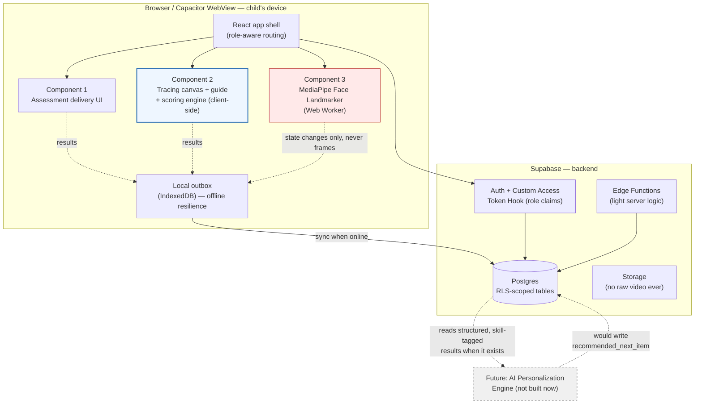
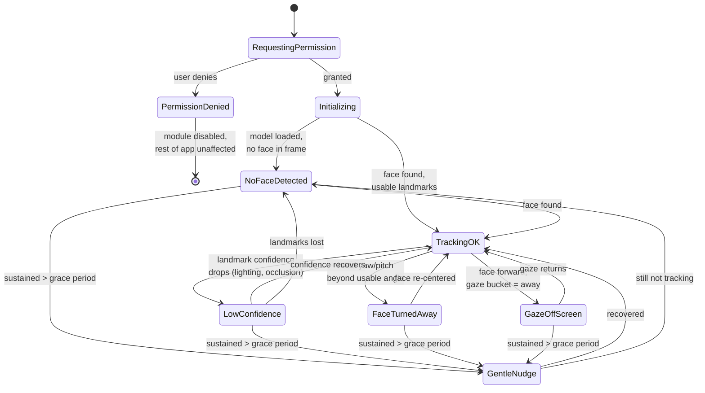

# Dyslexia-Support MVP — Technical Architecture & Stack Recommendation

> **Scope note.** This is the buildable-product repo. It implements a deliberately scoped-down MVP: **no EEG, no Indic-script/akshara content, no AI personalization engine.** Those are documented as *future* directions in the companion research repo (`Dyslexiaaa`, private) and referenced here only to show where this MVP leaves room for them — they are explicitly not being built now.

Three components, MVP scope:

1. **Psychometric assessment** — delivery/capture/storage scaffolding here; item content is a teammate's responsibility.
2. **Kinesthetic canvas tracing engine** (the core deliverable) — children trace English letters (A–Z) and numbers (0–9) on a touchscreen, with an animated SVG stroke guide, real shape-accuracy scoring, and multi-sensory (sound + haptic where supported) feedback.
3. **Gaze/attention-monitoring module** — webcam-based, browser-only, logs engagement state during a tracing session; degrades gracefully when the child's face isn't trackable.

---

## 0. Recommended stack at a glance

| Layer | Recommendation | One-line why |
|---|---|---|
| Frontend framework | **Vite + React 18 + TypeScript**, client-side SPA | Static `dist/` output → Capacitor-ready; largest ecosystem for canvas/SVG + MediaPipe integration; best AI-pair-programming coverage for a solo dev |
| Styling/theming | **Tailwind CSS v4 (`@theme`, CSS variables) + shadcn/ui** | Re-theme by editing CSS variables, not component code — matches the explicit "we'll reskin repeatedly" requirement |
| Client state | **Zustand** (UI/session state) + **TanStack Query** (server state via Supabase) | Canvas pointer events must bypass React re-renders entirely; Query handles cache/sync to Supabase cleanly |
| Tracing surface | **SVG guide (stroke-dasharray) + `perfect-freehand` ink layer**, raw pointer path captured separately for scoring | Reuses the reference repo's proven self-drawing SVG technique; keeps a real coordinate path around for shape comparison (Canvas 2D alone doesn't give you that) |
| Scoring algorithm | **Arc-length resampling → discrete Fréchet distance (or DTW) on concatenated stroke points + separate stroke-count/direction check**, hand-rolled (~100 lines) | Replaces placeholder circle-radius scoring with genuine shape comparison; cheap enough to run client-side in real time |
| Gaze/attention | **Browser-only: MediaPipe Face Landmarker (`@mediapipe/tasks-vision`) in a Web Worker**, scoped to face-presence + head pose + coarse gaze bucket — **no emotion inference, no server-side model** | Raw video never leaves the device; a server-side tier is a real future upgrade, not an MVP need |
| Sound | **Pre-generated static audio clips (36 files: A–Z, 0–9) + Howler.js**, Web Speech API only as a dev-time fallback | Browser TTS voice quality/availability is inconsistent across Android WebViews; 36 clips is cheap to produce once and removes a whole class of flakiness |
| Haptics | **`navigator.vibrate()`** on web (Android Chrome only — iOS Safari blocks it, no workaround) → **Capacitor Haptics plugin** once wrapped | Real platform limitation, not a bug to chase; sound + strong visual feedback is the cross-platform fallback channel |
| Backend/BaaS | **Supabase** (Postgres + Auth + Storage + Edge Functions + RLS) | Relational data fits assessment/session/attention logs far better than Firestore; RLS + JWT claims gives RBAC without a bespoke auth system |
| Auth/RBAC | Supabase Auth + **Custom Access Token Hook** injecting `role`/`child_ids`/`teacher_id` into `app_metadata` → RLS policies read the JWT claim | Current Supabase best practice; avoids a DB round-trip per request |
| Hosting | **Cloudflare Pages** (frontend) + **Supabase Cloud, Mumbai/Singapore region** (backend) | Strong PoP coverage in India specifically; nearby DB region for latency and DPDP-conscious defaults |
| Android path | **Capacitor** wrapping the static Vite build | Zero-rewrite path exactly because the SPA already builds to a static `dist/` |

---

## 1. Decision-by-decision: recommendation, justification, alternatives

### 1.1 Frontend framework

**Recommended: Vite + React + TypeScript, pure client-side SPA.**

Justification tied to the actual constraints: (a) Capacitor requires a static build with no server-rendering-at-request-time — Vite+React produces exactly that with zero configuration fighting; (b) this is a logged-in practice app, not a public content site, so Next.js's SSR/SEO machinery buys nothing and its `output: 'export'` mode means deliberately disabling most of what makes Next Next; (c) for a small team, React has the deepest coverage for the two hardest integration points here (MediaPipe Tasks Vision + freehand-canvas libraries), which materially reduces debugging time alone.

| Alternative | When you'd pick it instead |
|---|---|
| **Next.js (static export)** | If you later add genuinely public, SEO-relevant pages (a marketing/landing site, published research results) alongside the app — otherwise it's added complexity with no payoff here. |
| **SvelteKit (static adapter)** | If bundle size / runtime overhead becomes a real problem on low-end Android tablets (Svelte compiles away, no virtual-DOM tax). Legitimate technically, but smaller ecosystem, fewer solved examples for MediaPipe/canvas integration, and less AI-assist coverage — real friction on a deadline. |
| **React Native + React Native Web** | If you want one codebase for web+native from day one and are willing to accept RNW's rough edges on canvas/SVG-heavy interaction (this app is exactly that kind of app). Given the plan is "website now, Android later is fine," this front-loads risk that isn't needed yet. |
| **Flutter** | If native performance and native camera/haptics access (no WebView layer) matter more than reusing HTML/CSS/JS interaction patterns and JS team fluency. Real tradeoff: MediaPipe Tasks Vision's polished JS/WASM runtime has no Flutter equivalent — you'd be on `google_mlkit_face_mesh_detection` or platform channels, a genuinely different and less mature gaze-tracking path. |

### 1.2 Styling / theming

**Recommended: Tailwind CSS v4 + shadcn/ui.**

Tailwind v4's `@theme` directive compiles design tokens to live `:root` CSS custom properties, so a full re-skin becomes "edit one CSS file," not "touch every component" — directly matches "we will be changing and improving the UI/UX too." shadcn/ui components read semantic variables (`--primary`, `--background`) rather than hardcoding Tailwind classes internally, and because it's copy-in code (not an npm dependency), every component is owned and modifiable — important for a children's-app UI with atypical needs (large touch targets, high-contrast mode).

**Cheap extension worth adopting now:** two evidence-backed rendering transforms are worth exposing as manual settings via the same CSS-variable theming mechanism from day one — **inter-letter spacing** (`--tracking`, has real RCT support for dyslexic readers) and **line length** (`--line-length`). Nearly free given the theming architecture already in place, and it's the one piece of a future adaptive-rendering engine that can ship in the MVP without building any AI.

| Alternative | When you'd pick it instead |
|---|---|
| CSS Modules / vanilla-extract + hand-rolled tokens | If maximum control matters more than speed — more setup work, no community components to lean on. |
| Material UI / Chakra UI | If a large pre-built component catalog matters more than reskin flexibility — theming is JS-config-driven, which is *less* flexible for rapid reskinning than CSS-variable-driven Tailwind+shadcn. |

### 1.3 Client state management

**Recommended: Zustand for ephemeral UI/session state + TanStack Query for server state (via `supabase-js`).**

One implementation detail worth flagging explicitly: **pointer-move events during tracing must never go through React state at their native firing rate.** Write incoming points directly to a ref/plain array (or straight into the perfect-freehand input buffer) and only touch React/Zustand state on stroke-end (`pointerup`) or at a throttled interval for the live-ink visual. Routing every `pointermove` through a React re-render is a common cause of jank on exactly the low-end Android tablets this app will likely run on.

| Alternative | When you'd pick it instead |
|---|---|
| Redux Toolkit | If the team grows and strict action-based debugging/time-travel is needed — overkill at this scope. |
| Context API only | Fine for small, low-frequency state (auth, theme); do not use for stroke capture, for the reason above. |
| Jotai | If fine-grained atomic updates per letter/component are needed later — not necessary to introduce now. |

### 1.4 Tracing/canvas library and rendering surface

**Recommended: SVG throughout — `stroke-dasharray`/`stroke-dashoffset` for the guide animation, `perfect-freehand` for the child's ink layer, with the raw Pointer-Event coordinate array captured independently for scoring.**

**A correction worth flagging early:** `perfect-freehand`'s `getStroke()` does **not** hand back a centerline/skeleton path suitable for shape comparison — it returns the **outline polygon points of the stylized, variable-width ink shape**, meant for rendering, which then becomes an SVG `<path d="...">`. For scoring, what's needed is the *raw* pointer path (the input fed into `getStroke`, i.e. `{x, y, t, pressure}` per point), not its stylized output. So two parallel data flows must run off the same pointer events: one feeds `perfect-freehand` → SVG path → visual ink; the other feeds a resampler → similarity scoring. Small but load-bearing distinction to get right early.

Use **Pointer Events** (not separate mouse/touch handlers) — one API surface for mouse, touch, and stylus, with `preventDefault()` on `touchstart`/`pointerdown` to stop scroll/zoom gestures.

Capture strokes as an **ordered array of stroke segments** (new segment on every `pointerdown`), not one flat point blob. This matters for two reasons: (1) some letters genuinely need a pen lift (A, F, T, X) and stroke-order pedagogy cares about that; (2) it's the direct hook for future non-Latin script support, since akshara/conjunct strokes are inherently multi-segment.

Performance note for low-end Android: SVG re-render per point is fine at children's tracing speeds (the standard perfect-freehand use case), but if jank appears on cheap tablets, the documented mitigation is a live low-latency Canvas 2D ink layer during the stroke, converted to an SVG path only on stroke-end for storage/scoring — a fallback, not a day-one requirement.

| Alternative | When you'd pick it instead |
|---|---|
| Raw Canvas 2D | Zero dependencies, but path data has to be reconstructed from pixel data or point-tracked manually anyway — the same point array ends up being captured regardless, so perfect-freehand costs little and buys pressure-sensitivity + cleaner rendering for free. |
| `atrament` | Smaller/less maintained than perfect-freehand; no compelling reason to prefer it here. |
| Canvas-only live layer + SVG-on-commit hybrid | If profiling on target devices shows SVG re-render jank — the documented performance escape hatch, not the default. |

### 1.5 Gaze/attention-monitoring tier

**Recommended for the MVP: browser-only, MediaPipe Face Landmarker (`@mediapipe/tasks-vision`), running in a Web Worker, scoped strictly to face-presence + head pose + coarse gaze bucket. No server-side model, no gaze-to-pixel calibration, no emotion inference.**

Three points settle this rather than just inform it:

1. **Calibrated gaze-point regression (WebGazer-style) isn't needed for this task at all.** The requirement is "is the child paying attention," not "which word on screen are they looking at." What's actually needed — face presence, head pose (yaw/pitch/roll), eye openness, a coarse forward/away gaze bucket — MediaPipe's `FaceLandmarker` gives directly via `facialTransformationMatrixes` and blend shapes, **with no per-child calibration step**, strictly simpler than WebGazer's whole reason for existing.
2. **The known limitation that face-landmark detection struggles beyond ~45° head rotation is a feature here, not a bug** — no usable landmarks *is itself* the "child turned away" signal, not a failure to route around.
3. **Hard rule: on-screen/off-screen and head pose only, never emotion inference.** Good engineering practice regardless of jurisdiction, and it avoids two separate traps: the EU AI Act's emotion-recognition-in-education prohibition, and drifting this module toward looking like a dyslexia-*detection* tool (a screening patent family already exists in this space covering eye-tracking/interaction-based detection — this module should never be framed or marketed that way; it's an engagement proxy for a child already using the app, not detection of anything about the child's condition).

Run inference **throttled to ~2–5 fps** in a **Web Worker** — attention state doesn't need 30fps granularity, and the tracing canvas's pointer-response latency (which does need to feel instant) must not compete with WASM ML inference on the main thread. Both run concurrently during a session, so this isn't optional.

**Server-side tier (a dedicated gaze-estimation model like L2CS-Net via a FastAPI microservice): explicitly deferred**, not because it's a bad idea but because nothing in the MVP needs its precision. It adds a Python microservice, deployment/ops surface, and frame-upload latency, for a signal that currently has no downstream consumer that would benefit from angular precision. It also changes the privacy posture materially (§5). Document it as a **named future upgrade path**, to reach for only when genuine research-grade gaze-point data is needed (e.g., word-level reading-pattern studies), not for engagement monitoring.

| Alternative | When you'd pick it instead |
|---|---|
| **WebGazer.js** | If calibrated gaze-to-screen-pixel estimates are specifically needed and an effectively unmaintained dependency built on an older face model is acceptable. For this MVP's coarse-proxy need, MediaPipe alone is simpler and more current. |
| **Server-side (L2CS-Net + FastAPI)** | Once genuine gaze-angle precision is needed for research purposes, or once a future personalization engine wants a richer engagement signal than presence/pose can give. Treat this the same way a research-grade EEG arm would be treated — a separate, explicitly-labelled tier, not a default. |

### 1.6 Backend / BaaS

**Recommended: Supabase.**

Postgres fits the relational shape of assessment results, session data, and attention logs far better than Firestore; RLS + a Custom Access Token Auth Hook (injecting `role` and scoping IDs into `app_metadata`) is current best practice and avoids a DB lookup per request; and it gives a real admin UI (Table Editor) for free — worth calling out explicitly: the teammate handling assessment content can manage the reference letter/number corpus and (once ready) assessment items directly in Supabase Studio without any admin panel being built at all.

For light server-side logic (validating a submitted score before persisting, aggregating a teacher's roster view, rate-limiting), use **Supabase Edge Functions (Deno)** rather than standing up a separate Node service. Reserve a genuinely separate microservice for the day a server-side ML model (§1.5's future tier) is actually adopted.

| Alternative | When you'd pick it instead |
|---|---|
| **Firebase** | If real-time mobile SDKs and Google ecosystem integration matter more than relational data modeling — but Firestore is a worse fit for the psychometric/progress data shape, and Firebase Auth doesn't map as cleanly to fine-grained RLS-style RBAC. |
| **PocketBase** | If the absolute lowest-ops option matters most for a very small pilot (single Go binary, embedded SQLite, built-in admin UI). Real cost: SQLite's ceiling if scaling to multiple schools, weaker RLS-equivalent expressiveness than Postgres, and self-owned hosting/ops rather than Supabase Cloud absorbing it. Given future plans anticipate item-response-theory calibration and knowledge-tracing on real relational data, Postgres's maturity is worth the marginal setup cost now. |
| **Custom Node/Express + Postgres + Passport/JWT** | If control beyond what Supabase gives is needed — but this reinvents RLS, admin tooling, and auth infrastructure Supabase already provides, for no requirement that currently exists. |

### 1.7 Hosting/deployment

**Recommended: Cloudflare Pages for the static frontend build; Supabase Cloud, Mumbai or Singapore region, for the backend.**

Given the Indian-children target population, Cloudflare's PoP density in India is a genuine, non-generic reason to prefer it over Vercel/Netlify for this specific project, alongside its generous free tier for a student MVP. A nearby Supabase region is a latency win and a reasonable data-residency-conscious default.

### 1.8 Android porting path

**Recommended: Capacitor**, wrapping the static Vite build, once the web MVP is stable.

Concrete plugins to plan for: `@capacitor/haptics` (native vibration — and this is where the iOS Safari vibration gap actually gets solved, since Capacitor's Haptics plugin has real iOS Taptic Engine access if an iOS wrapper is ever built later), `@capacitor/app` (lifecycle), `@capacitor/preferences` (light local storage). Camera access for the gaze module should keep working largely unchanged inside Capacitor's WebView via standard `getUserMedia` — worth validating early on a real low-end Android device, since concurrent WASM ML inference + canvas drawing inside a WebView is the one place native-vs-web performance parity is least guaranteed. Budget explicit low-end-device testing time; this is a real risk to name now rather than discover late.

---

## 2. System architecture — how the three components connect

### What's client-only vs. what needs a backend call

| Component | Client-side (no round trip needed) | Backend interaction |
|---|---|---|
| **1. Assessment** | Rendering questions, capturing responses, immediate feedback for objective item types | Item bank fetched from Postgres (not hardcoded in the bundle, so content can be edited without a redeploy); **raw responses always persisted**, not just a computed score — scoring methodology can be revised later without re-collecting data |
| **2. Tracing engine** | Guide animation, live ink rendering, real-time scoring (Fréchet/DTW is cheap enough to run entirely in-browser), haptic/sound feedback — must work fully offline | Reference letter/number stroke corpus ships bundled in the static build (small JSON, not fetched per-letter); session results (score breakdown, timestamps, a compressed point array for replay) batched to Postgres asynchronously, queued locally if offline |
| **3. Gaze/attention** | Camera capture, inference, state-machine logic — raw video never leaves the device | Only derived state (`engaged`/`drifting`/`disengaged`/`untrackable` + confidence + timestamp) is periodically batched to Postgres, tied to the active session ID |

The offline-outbox pattern is deliberate, not incidental: connectivity in Indian school/home settings is not a given, and it applies just as directly to a home-tablet MVP as to a classroom deployment.

### Data model — what gets stored, at a glance

| Table (conceptual) | Key fields | Written by | Read by |
|---|---|---|---|
| `child_profiles` | id, parent_id, display_name, dob/age_band, active_settings | Parent/Teacher | Child (own), Parent (own children), Teacher (roster), Admin |
| `consent_records` | child_id, data_class (`assessment`/`tracing`/`camera_gaze`), granted_by, granted_at, revoked_at | Parent | Same as above; enforced at RLS + at feature level (camera module simply doesn't start if `camera_gaze` isn't granted) |
| `assessment_responses` | child_id, item_id, raw_response, submitted_at | Child session (via parent/teacher-authenticated device) | Parent/Teacher (own/roster), Admin |
| `tracing_sessions` | child_id, grapheme_id (`A`, `7`, …), score, sub_scores (shape/stroke-count/direction), stroke_data (compressed), started_at, completed_at | Tracing engine, client-batched | Parent/Teacher/Admin |
| `attention_logs` | session_id (fk → tracing_sessions), state, confidence, source (`gaze` now; `eeg`/`behavioral` reserved), started_at, duration | Gaze module, client-batched | Parent/Teacher (own/roster) view; Admin/research (aggregate) |
| `content_items` (letters/numbers now, assessment items later) | id, skill_tag, difficulty, script (`latin` now), provenance | Content owner via Supabase Studio | Client app (public read, RLS-gated by publish status) |

Two design choices here are deliberately future-proofing, not over-engineering: **always persist raw responses/strokes, not just derived scores** (lets scoring logic evolve retroactively), and **tag every content item and result with a `skill_tag`** even when today it's trivially just "the letter itself." Both cost nothing now and are exactly what a future personalization engine needs later (§3).

### RBAC roles

| Role | Can see | Can do | Cannot |
|---|---|---|---|
| **Child** (profile, not independent login) | Own progress, streaks, kid-friendly feedback | Take assessment, do tracing sessions | See other children's data, see raw scores/internals, change settings |
| **Parent/Guardian** | Own child(ren)'s full progress + reports | Create child profiles, grant/revoke consent **per data class independently**, view reports | See other families' data |
| **Teacher/Special Educator** | Roster of assigned children (via `teacher_child_assignments` join table) | Flag non-responders, add notes, view roster progress | See other teachers' rosters, change RBAC, see billing/config |
| **Admin/Researcher (internal)** | De-identified/pseudonymized aggregate data by default; break-glass re-identification path gated separately | Manage content bank, manage role assignments, view audit logs | — |

**Note on children ages 6–12:** they shouldn't independently manage credentials. A "profile" model is recommended instead of a true child login — the parent or teacher authenticates, and the child picks an avatar/PIN-free profile on a handed-off device. This is both more usable at this age and cleanly satisfies India's DPDP Act s.9 verifiable-parental-consent requirement, because consent is captured at the parent's authenticated session, not asserted by a self-declared child account.

### Where a future personalization engine slots in without a rearchitecture

Because results are already skill-tagged and raw data is always retained, adding an AI-driven content-routing layer later means: (1) a new service (start as a Supabase Edge Function) that reads `tracing_sessions`/`attention_logs`/`assessment_responses` and writes a recommendation; (2) swapping the tracing engine's "what's next" call from a hardcoded `nextInAlphabet()` to `getNextItem(childId)` — same interface, different implementation behind it. The single most important thing to get right now, for zero extra cost, is keeping that "what's next" decision behind one function boundary in the client, even though today it's trivial. The `attention_logs.source` field reserved for `eeg`/`behavioral` similarly means a future sensing upgrade is additive to the schema, not a redesign — and behavioural telemetry (idle gaps, error bursts, response latency) is nearly free to start logging *now* as a byproduct of data the tracing engine already timestamps — worth logging even before anything acts on it.

---

## 3. Tracing-accuracy scoring algorithm — concrete spec

This replaces a placeholder (fixed-radius-circle + point count, where a scribble in the middle of the canvas would score near 100%) with genuine shape comparison.

1. **Capture.** Each `pointerdown` starts a new stroke segment; record `{x, y, t, pressure?}` per point via `pointermove` at native rate (written to a ref, not React state). A traced grapheme is an ordered array of stroke segments.
2. **Reference authoring.** Each grapheme (`A`, `7`, …) is defined as an ordered list of reference strokes, each an SVG path — restructured into a JSON schema of `{grapheme_id, script, strokes: [{order, path_d, start_point, initial_direction_vector}]}`.
3. **Resampling.** Resample *both* the captured stroke points and the reference path to N points (N≈64–100) via **arc-length parameterization** — normalizes away drawing-speed variance and differing point counts between the child's input and the reference, the standard first step in the handwriting-comparison literature.
4. **Do not scale/position-normalize.** This is worth being explicit about: for *tracing* (drawing directly over a fixed-position, fixed-size guide), a child who draws in the wrong place or size relative to the guide should be penalized — unlike generic shape-recognition tasks, which typically want scale/translation invariance. Only correct for a genuine coordinate-space mismatch between the guide's SVG viewBox and the canvas's pixel space, not for the child's actual positioning.
5. **Shape similarity.** Concatenate the child's resampled stroke points in temporal order and compare against the similarly concatenated, resampled reference path using **discrete Fréchet distance** (classic Eiter–Mannila dynamic-programming formulation, O(N²), trivial to run client-side in real time at N≈100). Fréchet is recommended over DTW as the primary metric because it measures the maximum deviation ("leash length") between the curves, which maps more intuitively onto "did you stay on the line" than DTW's summed local cost (which can produce degenerate many-to-one matches that inflate similarity for genuinely different shapes). Computing both and blending is a reasonable v2, not necessary for v1.
6. **Stroke-count / order / direction check — a separate, secondary signal, not folded into shape distance.** For each reference stroke, check whether a captured stroke started within a tolerance radius of the reference's start point and whether its initial direction vector is within an angular tolerance of the reference's — a coarse categorical check, not a continuous metric. This matters pedagogically (correct letter formation habits) but should modulate the score (e.g., a small penalty per mis-ordered/mis-directed stroke, capped) rather than dominate it, since young children may trace a technically-correct shape via a non-standard stroke order.
7. **Visual feedback overlay.** As a byproduct of the same resampled comparison, compute per-point nearest-reference-point distance and use it to color-code the child's stroke (green where accurate, red where it drifted) — reuses work already done for the score and directly satisfies "show the child where they went wrong," distinct from the aggregate numeric score.
8. **Normalization and bands.** Normalize the raw Fréchet distance against the glyph's bounding-box diagonal to get a 0–100 score, combined with the stroke-order modifier (suggested starting weights: ~70% shape, ~15% stroke count, ~15% direction — **flagged explicitly as needing empirical tuning against a handful of real child traces before shipping**, not a threshold to guess and ship). Present the child with qualitative bands ("Great tracing!" / "Good, keep practicing" / "Let's try again together") rather than a raw number as the primary UX — a young child responds to encouraging visual/sound/haptic feedback, not a percentage.
9. **Build vs. buy.** The full pipeline is short enough (~100 lines) to hand-roll and own outright, preferable given this is the core deliverable — but small existing npm packages for exactly this (curve resampling + Fréchet-style comparison, e.g. `curve-matcher`) exist if preferred; verify current maintenance before depending on one.
10. **A legitimate cheaper v0, not a final answer.** A waypoint-crossing-in-order check (N ordered waypoints along the reference path with tolerance radii, score = fraction crossed in order) is worth building as a literal day-one stepping stone for something working immediately — but don't stop there; it's a variant of the same class of placeholder this is meant to replace.

---

## 4. Gaze-tracking failure-mode state machine

Design rules — per-signal hysteresis, sustained-duration gating, rate-limited intervention:

- **Every non-`TrackingOK` state requires N consecutive low-confidence frames or a rolling-window majority before transitioning** — a single bad frame (blink, momentary head turn) must not flip UI state or log a spurious event.
- **A sustained grace period (5–8s) in any non-tracking state** triggers a single gentle, non-punitive prompt ("Let's look at the screen together!" with a friendly visual/sound cue) — rate-limited so it doesn't nag every few seconds.
- **`PermissionDenied` / `CameraUnavailable` degrade to "module simply doesn't run"** — the tracing engine (Component 2) must never depend on gaze tracking succeeding; this is an additive signal, not a gate on the core experience.
- **Every state transition is logged with timestamp + duration** to `attention_logs`, satisfying "logged/displayed, not yet acted upon" without building any adaptive-response logic yet.
- **A parent/teacher-level toggle to disable the camera module per child entirely**, independent of every other consent class.

---

## 5. Privacy and consent — engineering judgment, not legal advice

- **India's DPDP Act 2023 s.9** requires verifiable parental consent for processing under-18 data, with penalties for breaches of children's-data obligations reaching ₹200 crore. The parent-owns-child-profile model (§2) is the mechanism: consent is captured at the parent's authenticated session, per data class (`assessment`, `tracing`, `camera_gaze`), independently revocable.
- **Browser-only gaze tier means raw video never leaves the device** — only derived numeric outputs (head-pose angles, presence boolean, gaze bucket, confidence) reach the backend. This is a strong, honest, and simple thing to tell a parent or an ethics reviewer, and it's the primary practical reason to prefer the browser-only tier for the MVP over a server-side model, independent of the cost/complexity argument in §1.5.
- **If a server-side tier (e.g. L2CS-Net) is adopted later, this guarantee breaks** — frames (or on-device-extracted features from a model that still needs a server) would need to leave the device. Treat that as a genuine privacy-posture downgrade requiring fresh consent language and likely fresh ethics sign-off, not a transparent backend swap.
- **Data minimization beyond the tier choice:** don't retain per-frame gaze data indefinitely — persist session-level state-transition summaries for progress tracking, keep any more granular log on a short retention window. Provide a clear, immediate child-initiated stop for the camera.
- **Framing note:** don't market or frame the gaze module as a "dyslexia detector" — it isn't one, it's an engagement proxy for a child already using the app, not a diagnostic tool. This keeps the module clearly outside the scope of existing eye-tracking/interaction-based screening patents in this space, and matches the project's own scope boundary: this system does not diagnose.

---

## 6. Sequencing / implementation strategy

1. **Scaffold**: Vite+React+TS app shell, Tailwind v4 + shadcn/ui theme tokens, Supabase project with the schema in §2 and RLS policies for the four roles — do this first since everything else depends on the auth/data shape being right, and it's cheap to get right now versus retrofitted later.
2. **Tracing engine (core deliverable) first**, before assessment or gaze — no dependency on the other two. Build in this order: guide animation (SVG path corpus) → capture + perfect-freehand ink → waypoint-crossing v0 scorer (get something real end-to-end fast) → replace with the Fréchet/resampling scorer (§3) → haptics/sound → offline outbox sync.
3. **Gaze module in parallel or immediately after**, since it's architecturally independent (its own Web Worker, its own log table) — integrate into the tracing session screen once both exist, being careful about the main-thread contention noted in §1.5.
4. **Assessment delivery UI last** among the three, since its scoring/content design is a teammate's responsibility and not yet finalized — build the generic delivery/capture/storage scaffolding now (raw-response persistence, per §2) so it's ready to receive real content whenever finalized.
5. **Calibrate the scoring constants** (§3 point 8, the Fréchet-to-score normalization) against a handful of real child traces before treating any score as final — budget this explicitly, don't ship a guessed constant.
6. **Capacitor wrap** only once the web MVP is stable and validated on a real low-end Android device for the concurrent-canvas+WASM-inference performance question flagged in §1.8.

Biggest risks to name now rather than discover late: low-end Android WebView performance with concurrent canvas + ML inference; browser TTS/voice inconsistency (mitigated by pre-generated audio, §0); and the Fréchet scoring constants needing real calibration data before the "real feedback" requirement is actually satisfied rather than just technically implemented.

---

## 7. Reference material

- **UX/interaction-pattern reference**: `project-dyslexia` repo, `module-3-multisensory/` folder (private) — the letter-selector → guide → canvas → check → stats/streak → auto-advance flow, and the SVG self-drawing (`stroke-dasharray`/`stroke-dashoffset`) technique are worth reusing as-is. Its scoring algorithm (fixed-radius-circle + point count) and its documentation claiming haptic feedback is implemented (it currently is not — `navigator.vibrate()` is not called anywhere in that codebase) should **not** be relied on as-is.
- **Companion research repo** (`Dyslexiaaa`, private): the source SAMR-LD framework analysis, the full evidence review on EEG/neurofeedback/facial-recognition/typography, the Indic-orthography white-space analysis, and the original four-module (Assessment / Neuro-sensing / AI-Engine / Content-Language) architecture this MVP scopes down from. Relevant files: `00-ARCHITECTURE.md`, `01-CRITICAL-REVIEW.md`, `02-MODULE-A-ASSESSMENT.md`, `03-MODULE-B-NEURO.md`, `04-MODULE-C-AI-ENGINE.md`, `05-MODULE-D-CONTENT-LANG.md`.
